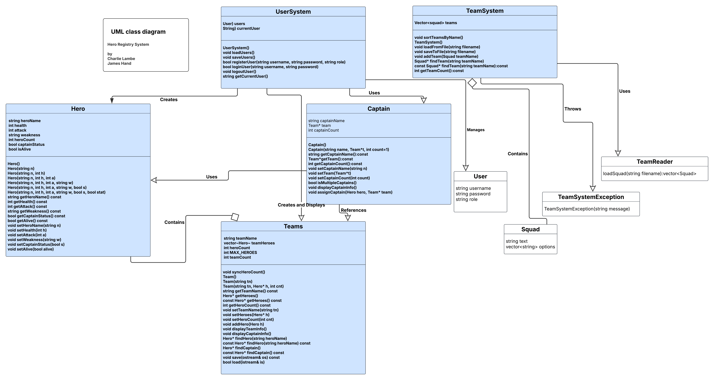

# Software Development Project - Hero Agency

## Overview

Hero Agency is a C++17 console application created for COMP2604. The project manages heroes, teams, captains, and saved team states through a menu-driven interface. The current version includes login and registration, team management, hero management, file persistence, sorting, custom exception handling, and automated testing/report generation through a companion CMake harness used during development.

## Authors

- James Hand - C23428162
- Charlie Lambe - C23324781

## Main Features

- Login and registration system for users
- View team summaries and captain information
- Create, rename, delete, and sort teams alphabetically
- Add heroes to teams, delete heroes, remove captain status, and sort heroes alphabetically
- Save and load team state from text files
- Custom exception handling for invalid team operations
- Automated unit tests, integration tests, cyclomatic complexity reporting, and coverage reporting in the development harness

## UML Diagrams

### Class Diagram



### Activity Diagram


## Project Structure

- `CPP_Files/` - source files for the application
- `Header_Files/` - header files for the application
- `tests/` - local project test artifacts already present in the repo
- `WhiteBoxTestPlan.txt` - white-box testing plan for the project
- `UML_Class_Diagram.png` - UML class diagram
- `UML_Activity_Diagram.jpeg` - UML activity diagram

## Software Needed

The project has been developed and validated on Windows. The following software is recommended:

- A C++17 compiler
- Current validated setup: TDM-GCC-64 / MinGW g++ on Windows
- CMake 3.14 or newer
- Python 3
- Optional Python packages for reporting: `lizard`, `gcovr`
- Optional development tools: Visual Studio Code, VS Code C/C++ extension, VS Code CMake support

The supplied VS Code build task in this workspace currently expects TDM-GCC-64 to be installed at `C:\TDM-GCC-64` on Windows.

## Building the Application

The main application itself is built directly from the repository source files.

### Build from VS Code

Use the default build task:

- `build-all`

### Manual Build From the Repository Root

Example Windows command:

```cmd
C:\TDM-GCC-64\bin\g++.EXE -std=c++17 -Wall -Wextra CPP_Files\main.cpp CPP_Files\captain.cpp CPP_Files\hero.cpp CPP_Files\menu.cpp CPP_Files\team.cpp CPP_Files\team_reader.cpp CPP_Files\team_system.cpp CPP_Files\user_system.cpp -lshell32 -o CPP_Files\app.exe
```

This creates `CPP_Files\app.exe`.

## Running the Application

After building, run:

```cmd
CPP_Files\app.exe
```

## Files Used by the Program

The application reads from and writes to plain text files, including:

- `users.txt`
- `teams.txt`
- `teams_state.txt`
- `heroes.txt`

## Exception Handling Used in the Project

The project uses both user-defined and built-in exception handling.

- `TeamSystemException` is a custom exception used when invalid team operations occur, such as adding a duplicate team or using an empty team name.
- Standard library exceptions can occur during parsing in functions such as `Team::load()` when invalid saved data is converted using `std::stoi()`.

## CMake Tools Used During Development

The main application repo does not use CMake for its direct executable build. During development, however, a companion CMake/GoogleTest wrapper project was used to automate testing and generate reports for this codebase.

The CMake-based tools and features used were:

- `CMake` for configure and build steps
- `CTest` for automated test execution
- `FetchContent` to download and configure GoogleTest
- `gtest_discover_tests()` to register GoogleTest cases with CTest
- `testing_report` custom target for unit tests plus cyclomatic complexity HTML output
- `coverage` custom target for unit tests plus coverage plus cyclomatic complexity HTML output
- `gcovr` for coverage reporting in the coverage build
- `lizard` for cyclomatic complexity calculations in the HTML reports

## Test and Report Outputs Used During Development

In the companion testing harness, the following outputs were generated:

- `build/gtest-results/index.html` - unit tests plus cyclomatic complexity
- `build-coverage/gtest-results/index.html` - unit tests plus coverage plus cyclomatic complexity
- `build-coverage/coverage.html` - raw file-level coverage report

These reports covered tests such as:

- `MenuTest`
- `TeamSystemTest`
- `TeamTest`
- `UserSystemTest`
- `RunMain`

## White-Box Testing

The project includes a white-box test plan in `WhiteBoxTestPlan.txt`.

Two techniques identified in that plan are:

- Branch and decision coverage
- Basis path testing

## Summary

This project demonstrates:

- object-oriented C++ design
- file handling
- sorting and searching with the STL
- custom exception handling
- structured menu-driven user interaction
- automated testing and reporting through a CMake-based development harness
